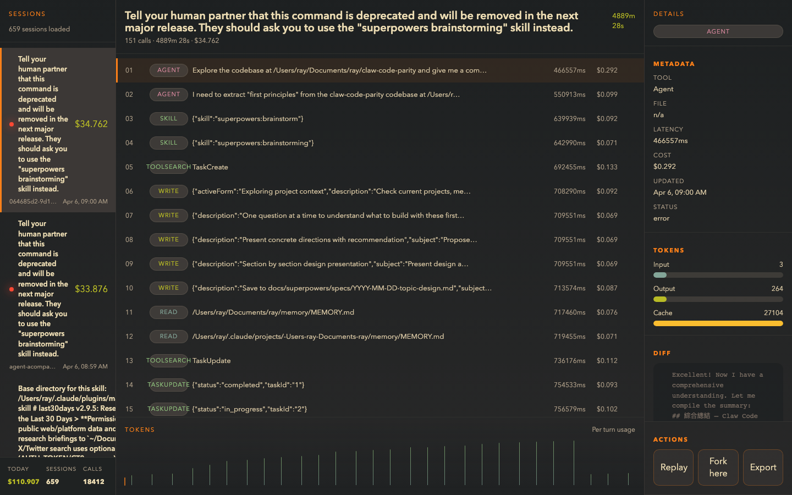

# agent-trace

> Observe your Claude Code sessions. See every tool call, cost, and diff — in a beautiful desktop app.



[](https://github.com/raytien/agent-trace/actions)
[](LICENSE)
[](#installation)

---

Claude Code already writes every session to `~/.claude/sessions/*.jsonl`. agent-trace reads those files, pairs every `tool_use` with its result, calculates the exact cost, and shows it all in a lazygit-style interface. **No config, no API keys, no cloud.**

## Features

- 🔍 **Real-time observation** — sessions appear automatically as Claude Code runs
- 💰 **Per-tool cost breakdown** — see exactly what each `Bash` / `Read` / `Edit` call costs in USD
- 🌿 **Gruvbox dark theme** — catppuccin, dracula coming soon
- 🔌 **Local REST + WebSocket API** — integrate with CI, Slack webhooks, or build your own UI
- ⚡ **Fork & Replay** — jump back to any tool call and try a different path *(coming soon)*

## Installation

```bash
# macOS / Linux
curl -fsSL https://raw.githubusercontent.com/raytien/agent-trace/main/install.sh | sh

# Or via Cargo
cargo install --git https://github.com/raytien/agent-trace
```

Download prebuilt binaries from [Releases](https://github.com/raytien/agent-trace/releases).

## Quick start

```bash
# 1. Start the daemon (reads ~/.claude/sessions automatically)
agent-trace serve

# 2. Open the desktop app
#    Download from Releases, or run dev mode:
npm install && npm run tauri -- dev

# 3. Use Claude Code normally — sessions appear in real time
```

## API

The daemon exposes a local API on `http://127.0.0.1:7842`:

```bash
# List all sessions
curl http://127.0.0.1:7842/api/sessions

# Get full tool call trace for a session
curl http://127.0.0.1:7842/api/sessions/<id>/trace

# Get cost breakdown
curl http://127.0.0.1:7842/api/sessions/<id>/cost

# Stream live updates (WebSocket)
wscat -c ws://127.0.0.1:7842/api/stream
```

Build your own integration — CI cost alerts, Slack notifications, Grafana dashboards.

## Development

```bash
# Backend
cargo test
cargo run -- serve

# Frontend
npm install
npm run dev       # Vite dev server
npm test          # UI tests
npm run build     # Production build

# Full desktop app
npm run tauri -- dev
```

## License

MIT
